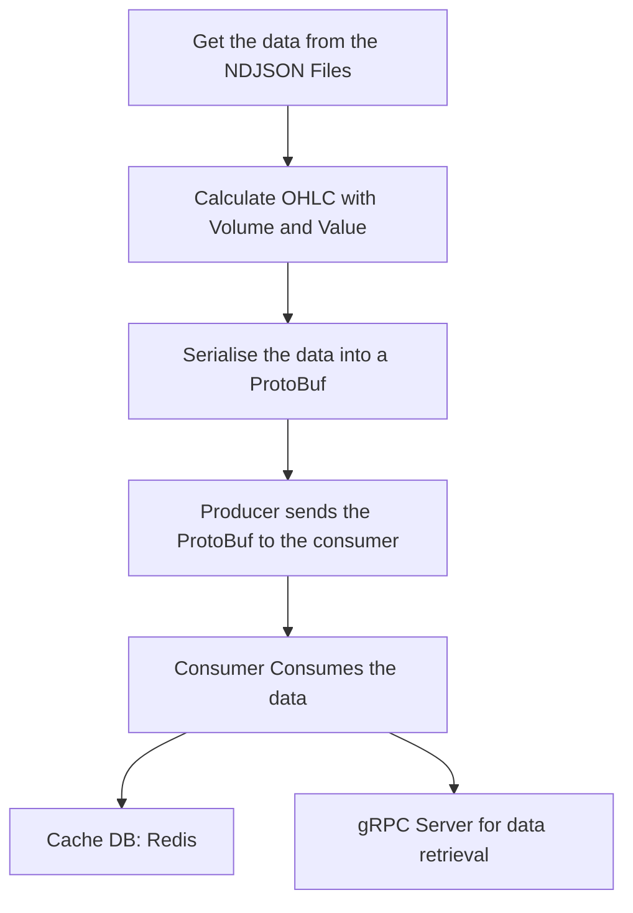

# OHLCTradingSystem

A basic system that takes data from NDJSON files, calculates the OHLC with
volume and value, converts all the data to a ProtoBuf and sends it to a Kafka consumer (via a Kafka producer) which then saves it in a Redis cache and makes it available via a gRPC server based on the stock.

# Project Structure

    - Data loader: Loads in the data from the
    - kafka client + gRPC server

# Build instructions

## Dependencies

To compile the program, you need to install **CMake** and the following libraries:

- **Boost**, as it's a dependency for CppKafka
- **librdkafka**, which is also a dependency for CppKafka

All the other required libraries are automatically fetched and built using CMake.

## Compilation

To generate the makefile(s) for the project, run `cmake . -Bbuild` from the root of the project, then change the current working directly to `build/` and run the generator that was used by CMake, on UNIX-like systems, it's mostly either `make` or `ninja`.

## Running

To run the program, you must modify the `settings.json` file stored in the same folder as the executable to suit your environment. Here, you need to set:

- The Kafka broker (kafka_broker)
- The Kafka topic (kafka_topic)
- Event polling delay (poll_delay)
- Maximum queue buffering time (queue_max_time)
- Consumer group id (group_id)
